# Car Insurance Data Engineering Platform

## 📌 Introduction

This project is an **end-to-end Data Engineering project** built around a car insurance use case. The project demonstrates how data from multiple sources can be ingested, processed, transformed, and organized into a unified data platform using **Databricks**.

The system is designed to handle different types of data and ingestion patterns, including:

- **Streaming data** from Apache Kafka
- **Batch data** from PostgreSQL
- **Object and image data** from Amazon S3

Kafka and PostgreSQL are hosted on **AWS EC2**, while Databricks serves as the central platform for data ingestion, processing, transformation, and analytics.

The processed data follows the **Medallion Architecture**, moving through the **Bronze → Silver → Gold** layers. **Unity Catalog** is used as part of the Databricks data management and governance layer.

The resulting data platform provides a foundation for potential downstream use cases in the car insurance domain, such as:

- Insurance claim analytics
- Vehicle damage assessment from images
- Fraud detection

## 🎯 Purpose of the Project

The primary purpose of this project is **not to build a production-ready insurance system**, but to gain practical experience in designing and implementing an end-to-end Data Engineering platform with Databricks.

The project focuses on learning and experimenting with:

- Building an end-to-end data pipeline with **Databricks**
- Ingesting data from multiple heterogeneous sources
- Implementing **batch data ingestion** from PostgreSQL
- Implementing **real-time data streaming** with Apache Kafka
- Working with **object and image data** stored in Amazon S3
- Designing a **Medallion Architecture**
- Managing data with **Unity Catalog**
- Preparing data for downstream **Analytics and AI/ML workloads**
- Integrating different AWS services and data technologies into a unified Data Engineering architecture

Through this project, the goal is to understand not only how individual technologies work, but also **how they can be combined to build a complete data platform from data ingestion to downstream consumption**.

## 🏗️ Architecture

The overall architecture of the project is designed to ingest data from
multiple sources, process and transform it in Databricks using the
**Medallion Architecture**, and provide a foundation for downstream
analytics and AI/ML use cases.

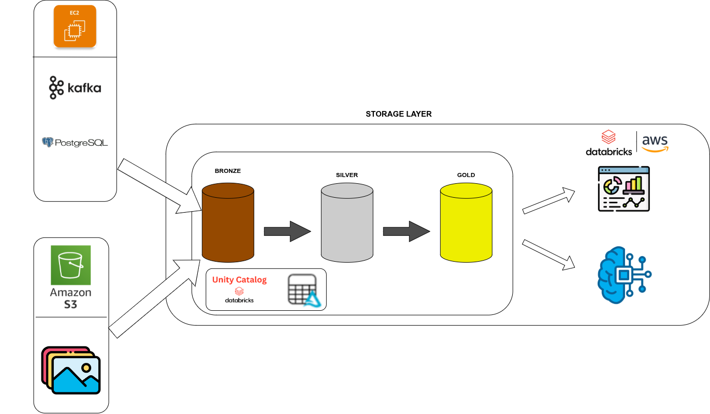
## 🔨 Development Process

The project was developed incrementally, starting from the infrastructure
and data sources, followed by data ingestion, data processing, data quality,
orchestration, and finally analytics.

The following sections provide visual evidence of the implementation process.

### 1. Infrastructure Setup

The first step was to prepare the infrastructure required for the data
platform.

Kafka and PostgreSQL were deployed on AWS EC2 and configured to communicate
with the Databricks environment.

#### PostgreSQL Network Configuration

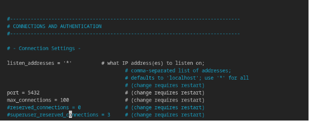

Additional network configuration was performed to allow the required
communication between PostgreSQL and the data processing environment.

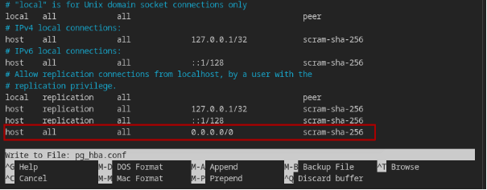

---

### 2. Databricks Environment Setup

After preparing the infrastructure, the Databricks environment was
configured for the project.

A Databricks user was created and the required permissions were granted
to access and work with the project resources.

#### Create Databricks User

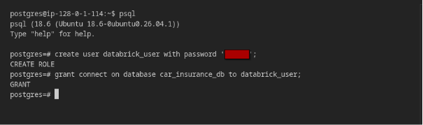

#### Grant Permissions

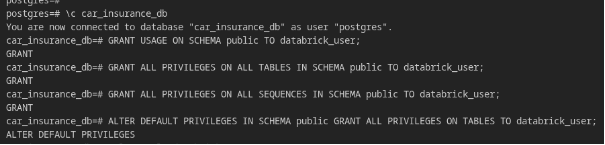

---

### 3. Data Sources and Data Preparation

The project uses multiple data sources to demonstrate different data
ingestion patterns.

The main sources include:

- PostgreSQL for structured batch data
- Apache Kafka for streaming data
- Amazon S3 for object and image data

The PostgreSQL source contains insurance-related relational data such as
customers, policies, and claims.

#### PostgreSQL Data Preparation

The source database was initialized by creating the required tables and
inserting the initial datasets.

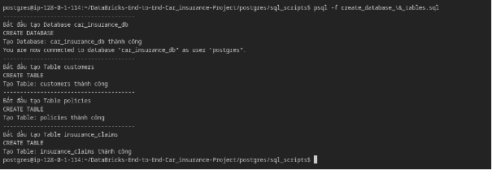

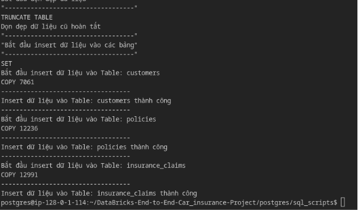

---

### 4. Batch Data Ingestion from PostgreSQL

The next step was to implement batch data ingestion from PostgreSQL into
Databricks.

The ingestion process extracts structured data from PostgreSQL and loads
it into the Databricks data platform.

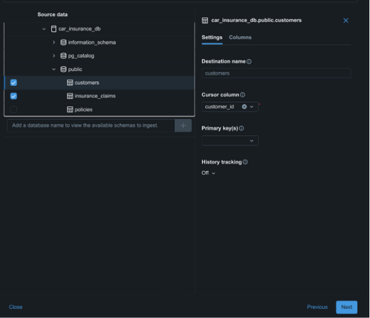

The ingestion results can be verified through the resulting datasets in
Databricks.

#### Customers

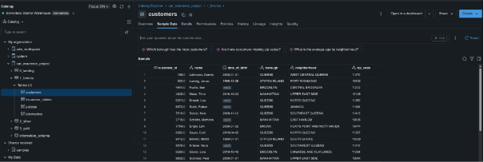

#### Policies

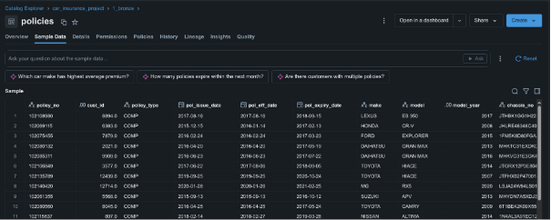

#### Claims

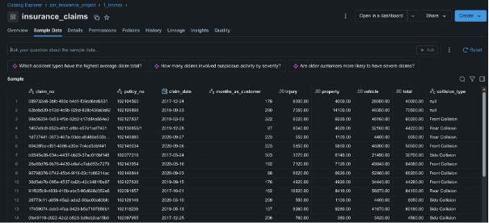

---

### 5. Streaming Data Ingestion with Kafka

In addition to batch ingestion, the project implements a streaming data
pipeline using Apache Kafka.

A producer is used to generate and publish insurance-related events to
Kafka. Databricks then consumes the streaming data and processes it as
part of the data pipeline.

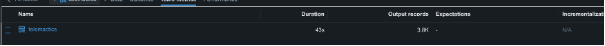

The raw Kafka data is captured and processed within the Databricks
environment.

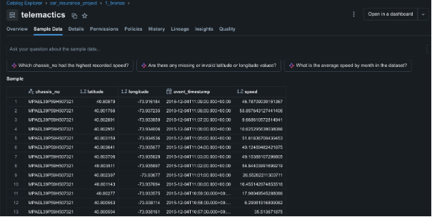

---

### 6. Medallion Architecture

The data platform follows the **Medallion Architecture**, which separates
data processing into three logical layers:

```text
Bronze
   ↓
Silver
   ↓
Gold
